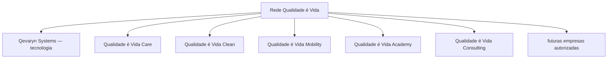

> Este documento representa uma baseline estratégica e empresarial em elaboração. Não constitui contrato, parecer jurídico, aconselhamento fiscal, certificação de conformidade ou compromisso comercial público.

# Rede Qualidade é Vida — Governança, Marca, Cooperação e Regras Institucionais

## 1. Resumo executivo

A Rede Qualidade é Vida é uma **estrutura institucional e de marca** que poderá reunir empresas independentes, ligadas por propósito comum, valores, padrões mínimos, reputação partilhada, regras de utilização da marca, mecanismos de fiscalização e oportunidades voluntárias de cooperação.

A Rede não é uma única empresa composta por departamentos internos. Cada empresa integrante mantém a sua gestão, os seus contratos, os seus trabalhadores, os seus clientes, a sua contabilidade, o seu património, as suas receitas, as suas despesas, os seus lucros, os seus prejuízos, as suas dívidas e as suas responsabilidades.

Princípios institucionais confirmados (`DECIDIDO`):

> A Rede Qualidade é Vida não deve ser tratada como uma única empresa composta por departamentos internos.

> Cada empresa integrante mantém gestão, contratos, trabalhadores, clientes, contabilidade, património, receitas, despesas, lucros, prejuízos, dívidas e responsabilidades próprios.

> Uma empresa integrante não responde automaticamente pelas obrigações de outra empresa integrante.

Este documento preserva estas decisões para que não fiquem perdidas em conversas ou sejam substituídas silenciosamente por novas ideias. Complementa [Qevaryn Systems — Identidade Empresarial, Operação e Modelo de Negócio](qevaryn-systems.md) e [Qevaryn Platform — Plataforma Modular e Primeiro Produto "Pedidos e Trabalhos"](../products/qevaryn-platform-first-product.md).

## 2. Propósito da Rede

A Rede existe para:

- promover qualidade de vida;
- incentivar serviços responsáveis;
- organizar empresas sob padrões comuns;
- gerar confiança junto de clientes e parceiros;
- facilitar cooperação entre integrantes;
- permitir crescimento por áreas de atividade;
- proteger a reputação comum;
- incentivar inovação;
- combinar conhecimento operacional, humano e tecnológico.

A existência da Rede não implica que todas as empresas já existam juridicamente. É necessário separar sempre:

- empresas existentes (com provas documentais de constituição);
- empresas planeadas (sem constituição ainda);
- nomes de exemplo (referências ilustrativas);
- áreas futuras (intenções de crescimento).

Nenhuma empresa deve ser apresentada como constituída ou ativa sem confirmação documental.

## 3. O que a Rede é

A Rede poderá funcionar, consoante decisão futura, como (`PROPOSTA` / `A VALIDAR`):

- marca institucional;
- sistema de licenciamento de utilização da marca;
- conjunto de padrões mínimos de qualidade e conduta;
- estrutura de cooperação;
- comunidade empresarial;
- mecanismo de reputação;
- estrutura para projetos conjuntos;
- base futura para franquias autorizadas.

Cada um destes papeis depende de validação jurídica e da confirmação do proprietário.

## 4. O que a Rede não é

A Rede não deve ser automaticamente considerada:

- uma holding;
- uma única sociedade;
- um grupo económico formal;
- uma sociedade entre todos os integrantes;
- um empregador comum;
- uma conta bancária comum;
- uma entidade que assume todas as dívidas dos integrantes;
- uma franquia automática;
- uma garantia financeira entre empresas;
- uma autorização para usar livremente todas as marcas;
- uma autorização para sublicenciar;
- uma obrigação de investir em todos os projetos.

Estes pontos estão sujeitos a validação jurídica e não podem ser assumidos sem instrumentos legais que os suportem (`A VALIDAR`).

## 5. Estrutura possível da Rede

A seguinte estrutura é um `EXEMPLO` ilustrativo, não uma lista de empresas constituídas:

```text
Rede Qualidade é Vida
│
├── Qevaryn Systems — tecnologia
├── Qualidade é Vida Care — cuidados e apoio
├── Qualidade é Vida Clean — limpeza
├── Qualidade é Vida Mobility — mobilidade e transportes
├── Qualidade é Vida Academy — formação
├── Qualidade é Vida Consulting — consultoria
└── futuras empresas autorizadas
```

Os nomes Care, Clean, Mobility, Transport, Academy e Consulting são referências históricas ou propostas. Não devem ser tratados como empresas legalmente constituídas sem confirmação documental.



*Figura 1 — Estrutura possível da Rede. Os nós representam áreas de exemplo, não empresas constituídas.*

## 6. Propriedade da marca

Princípios documentados (`DECIDIDO`, com detalhes `A VALIDAR`):

- a marca deve possuir um titular identificado;
- o titular controla a autorização de uso;
- a licença de utilização deve ser escrita;
- a autorização deve indicar o segmento ou atividade autorizada;
- a licença não deve ser automaticamente transferível;
- a licença não deve permitir sublicença sem autorização expressa;
- a utilização da marca pode depender da manutenção dos padrões;
- o titular pode proteger a identidade e a reputação da Rede;
- a retirada da marca não deve ser arbitrária e precisa de regras objetivas.

Pontos que ainda precisam de validação (`A VALIDAR`):

- titular jurídico definitivo da marca;
- classes de marca a registar;
- território protegido;
- registos no Registo Nacional de Pessoas Coletivas (RNPC);
- registos no Instituto Nacional da Propriedade Industrial (INPI);
- registos no Instituto da Propriedade Intelectual da União Europeia (EUIPO);
- titularidade dos domínios;
- titularidade dos ficheiros originais dos logótipos.

## 7. Papel de Gabriel

Documentado como `DECIDIDO` em termos estratégicos:

Gabriel pretende:

- proteger o nome e a identidade da Rede;
- preservar a visão institucional;
- definir os padrões mínimos;
- autorizar empresas integrantes;
- acompanhar a reputação da Rede;
- participar das decisões institucionais;
- liderar a área tecnológica através da Qevaryn Systems.

Não deve ser afirmado automaticamente que Gabriel será:

- administrador legal de todas as empresas;
- empregador de todos os trabalhadores;
- responsável por todas as dívidas;
- representante legal de todas as operadoras;
- gestor diário de todos os segmentos.

Esses pontos dependem da estrutura jurídica futura e estão `A VALIDAR`.

## 8. Autonomia das empresas

Cada operadora integrante deve controlar (`DECIDIDO`, em termos de princípio):

- gestão diária;
- contratação;
- salários;
- horários;
- fornecedores;
- clientes;
- preços;
- orçamento;
- conta bancária;
- contabilidade;
- seguros;
- contratos;
- operação;
- impostos;
- licenças do seu setor.

A Rede poderá fiscalizar padrões institucionais, mas não deve interferir automaticamente em cada decisão operacional. A intervenção institucional deve limitar-se aos padrões acordados e às regras de utilização da marca.

## 9. Separação financeira

Regras de princípio (`DECIDIDO`):

- não misturar contas entre empresas;
- não pagar despesas sem registo;
- não utilizar dinheiro de uma empresa como se fosse de outra;
- projetos conjuntos precisam de orçamento próprio;
- transferências entre empresas precisam de fundamento e registo;
- serviços prestados entre integrantes precisam de documentação;
- investimentos devem indicar valor, risco e retorno esperado;
- contribuições não financeiras também devem ser registadas.

Pontos que precisam de validação (`A VALIDAR`):

- modelo de faturação entre empresas;
- tributação aplicável;
- preços de transferência;
- empréstimos entre empresas;
- distribuição de lucros;
- fundos comuns;
- fundo de marketing;
- taxas da Rede.

## 10. Cooperação interna

Definido como `DECIDIDO`:

> As empresas podem cooperar, mas a cooperação não é uma obrigação automática de investimento.

Regras de cooperação (`PROPOSTA`):

- oportunidades podem ser apresentadas primeiro à Rede;
- cada empresa pode recusar participar;
- a recusa não implica punição;
- a participação deve ser voluntária;
- responsabilidades precisam de contrato;
- a contribuição pode ser financeira, técnica, operacional ou comercial;
- a propriedade intelectual deve ser definida;
- a divisão de receitas deve ser definida;
- os limites de perda devem ser definidos;
- a saída de participantes deve ser definida.

Expressão de referência:

> Prioridade interna sem obrigação de participação.

## 11. Projetos conjuntos

Fluxo conceptual (`PROPOSTA` / `A VALIDAR`):

```text
Oportunidade identificada
→ apresentação às empresas relevantes
→ análise individual
→ decisão voluntária
→ proposta de projeto
→ orçamento
→ definição de responsabilidades
→ contrato específico
→ execução
→ prestação de contas
→ encerramento ou continuidade
```

Projetos maiores poderão justificar (`A VALIDAR JURIDICAMENTE`):

- contrato de consórcio;
- sociedade específica;
- empresa de projeto;
- acordo de parceria;
- subcontratação;
- licenciamento tecnológico.

## 12. Conselho da Rede

Documentado como `PROPOSTA` a criação futura de um Conselho Qualidade é Vida.

Possíveis funções:

- discutir a reputação da Rede;
- analisar novos integrantes;
- discutir campanhas institucionais;
- partilhar oportunidades;
- analisar reclamações graves;
- propor padrões;
- acompanhar projetos comuns;
- discutir riscos.

Limites que devem ser respeitados:

- não administrar automaticamente as empresas;
- não contratar trabalhadores de outra empresa;
- não controlar contas bancárias de outra empresa;
- não determinar preços internos sem competência;
- não assumir poderes não previstos em contrato.

Possíveis regras a definir (`PROPOSTA`):

- composição;
- direito de voto;
- impedimentos;
- atas;
- conflitos de interesse;
- quórum;
- recurso;
- participação de especialistas.

## 13. Entrada de uma empresa na Rede

Processo descrito como proposta (`PROPOSTA`, não juridicamente aprovado):

1. candidatura;
2. identificação dos proprietários;
3. análise do segmento;
4. análise reputacional;
5. verificação documental;
6. análise de conflitos;
7. aprovação;
8. contrato de licença;
9. formação inicial;
10. entrega dos manuais;
11. período acompanhado;
12. auditoria inicial.

## 14. Padrões mínimos

Possíveis padrões institucionais (`PROPOSTA` / `A VALIDAR`):

### Atendimento

- clareza;
- respeito;
- identificação;
- prazos realistas;
- comunicação;
- tratamento de reclamações;
- não discriminação.

### Qualidade

- serviço conforme combinado;
- evidências quando aplicável;
- controlo de falhas;
- ação corretiva;
- documentação;
- melhoria contínua.

### Pessoas

- respeito;
- segurança;
- formação;
- responsabilidade;
- proteção de pessoas vulneráveis;
- proibição de abuso;
- canais de denúncia.

### Dados

- minimização;
- controlo de acesso;
- confidencialidade;
- retenção adequada;
- resposta a incidentes;
- transparência.

### Financeiro

- contratos;
- faturas;
- registos;
- separação;
- prestação de contas em projetos comuns.

### Comunicação pública

- não inventar resultados;
- não inventar clientes;
- não prometer o que não existe;
- não utilizar a marca para atividades não autorizadas.

## 15. Fiscalização

Modelo progressivo (`PROPOSTA` / `A VALIDAR`):

1. orientação;
2. pedido de esclarecimentos;
3. plano de correção;
4. acompanhamento;
5. advertência formal;
6. suspensão temporária;
7. retirada da licença;
8. medidas jurídicas quando necessárias.

Garantias que devem existir:

- registo;
- proporcionalidade;
- direito de resposta;
- prazo de correção;
- recurso;
- documentação da decisão.

O processo de fiscalização não pode criar um poder ilimitado ou arbitrário.

## 16. Reclamações

Fluxo conceptual:

```text
Receção
→ classificação
→ confirmação ao reclamante
→ recolha de evidências
→ resposta da empresa
→ análise
→ ação corretiva
→ encerramento
→ aprendizagem
```

Deve separar tipos de reclamação:

- reclamação operacional da empresa;
- reclamação sobre uso da marca;
- reclamação grave;
- risco a pessoas;
- risco de dados;
- fraude;
- conflito entre integrantes.

## 17. Saída e encerramento

Situações a documentar (`PROPOSTA` / `A VALIDAR`):

- saída voluntária;
- retirada por incumprimento;
- encerramento da empresa;
- venda da empresa;
- mudança de controlo;
- mudança de segmento;
- falência ou insolvência;
- devolução de materiais;
- retirada de logótipos;
- término dos acessos;
- comunicação a clientes;
- preservação de documentos;
- obrigações pendentes.

## 18. Franquias e sublicenças

Definido como `DECIDIDO`:

> A licença normal de integrante não autoriza automaticamente franquias ou sublicenças.

Uma empresa que pretenda franquear deverá apresentar (`PROPOSTA` / `A VALIDAR`):

- modelo;
- território;
- padrões;
- formação;
- suporte;
- investimento;
- taxas;
- fiscalização;
- contrato;
- proteção da marca;
- critérios de saída.

A aprovação deve ser específica e documentada para cada caso.

## 19. Familiares

Regras de princípio (`DECIDIDO` / `A VALIDAR`):

- parentes não ficam dispensados das regras da Rede;
- relações pessoais não substituem contratos;
- conflitos de interesse devem ser declarados;
- decisões precisam de registo;
- pagamentos precisam de fundamento;
- responsabilidades devem ser claras.

## 20. Arquitetura de marcas

Hierarquia a preservar:

```text
Marca institucional:
Rede Qualidade é Vida

Marca da operadora tecnológica:
Qevaryn Systems

Produto da operadora:
Qevaryn Platform

Sistema dentro do produto:
Pedidos e Trabalhos
```

Diferenciar sempre:

- marca institucional;
- marca empresarial;
- marca de produto;
- nome de módulo;
- selo de integrante;
- co-branding;
- marca do cliente.

## 21. Regras dos logótipos

Documentado como `PROPOSTA`, sem criar imagens.

### Variantes necessárias

- principal;
- horizontal;
- vertical;
- símbolo;
- fundo claro;
- fundo escuro;
- monocromática;
- impressão;
- digital;
- favicon;
- selo de integrante.

### Regras de utilização

- não deformar;
- não esticar;
- não alterar proporções;
- não mudar cores arbitrariamente;
- não adicionar sombras não autorizadas;
- não adicionar contornos;
- não recriar tipografia;
- não alterar o símbolo;
- não reduzir abaixo do tamanho mínimo;
- preservar a área de proteção;
- utilizar o ficheiro adequado ao fundo;
- não combinar marcas sem regra definida.

### Qevaryn Systems

Preservar a família visual já definida no projeto (`DECIDIDO` quanto à identidade atual):

- azul-marinho;
- dourado;
- branco;
- aparência tecnológica;
- aparência premium;
- software-first;
- consistência;
- legibilidade.

### Relação com a Rede

Formas de assinatura sugeridas (`PROPOSTA`):

- "Integrante da Rede Qualidade é Vida";
- "Operadora tecnológica integrante da Rede Qualidade é Vida";
- selo institucional discreto.

A Rede não deve ser apresentada como o produto vendido pela Qevaryn Systems.

### Páginas dos clientes

Quando uma empresa cliente utilizar a Qevaryn Platform (`PROPOSTA` / `A VALIDAR`):

- a identidade do cliente deve ser principal;
- o logótipo do cliente deve ser visível;
- as cores do cliente podem ser configuráveis;
- "Powered by Qevaryn" deve ser discreto;
- a marca da Rede não deve ocupar o lugar da marca do cliente.

## 22. Nomes históricos e referências

| Nome | Tipo | Contexto | Classificação | Pode ser utilizado? | Precisa de validação? |
| --- | --- | --- | --- | --- | --- |
| Qualidade é Vida | Marca institucional | Nome base da Rede | DECIDIDO (identidade atual) | Sim, no contexto institucional | Sim (marca) |
| Qevaryn Systems | Empresa | Operadora tecnológica | DECIDIDO (empresa atual) | Sim | Sim (constituição) |
| Qevaryn Platform | Produto | Plataforma modular futura | PROPOSTA / A VALIDAR | Em documentos internos | Sim |
| Care | Segmento de exemplo | Cuidados e apoio | EXEMPLO | Não como empresa constituída | Sim |
| Clean | Segmento de exemplo | Limpeza | EXEMPLO | Não como empresa constituída | Sim |
| Mobility | Segmento de exemplo | Mobilidade e transportes | EXEMPLO | Não como empresa constituída | Sim |
| Transport | Referência histórica | Setor de transportes | HISTÓRICO | Apenas em contexto histórico | Sim |
| Academy | Segmento de exemplo | Formação | EXEMPLO | Não como empresa constituída | Sim |
| Consulting | Segmento de exemplo | Consultoria | EXEMPLO | Não como empresa constituída | Sim |
| CareFlow | Conceito histórico | Conceito de cuidados (legacy) | HISTÓRICO | Não publicamente | Sim |
| KitchenSync | Conceito histórico | Conceito de cozinha/pedidos (legacy) | HISTÓRICO | Não publicamente | Sim |
| Qevaryn Ops | Conceito histórico | Conceito de gestão interna | HISTÓRICO / EXEMPLO | Apenas como conceito | Sim |
| FieldControl | Conceito histórico | Conceito de equipas externas | HISTÓRICO | Não publicamente | Sim |
| FieldOps | Produto conceito atual | Equipas externas, presente no catálogo | HISTÓRICO / A VALIDAR | Sim, como conceito no site atual | Sim |
| Stock & Orders | Produto conceito atual | Stock e compras, presente no catálogo | HISTÓRICO / A VALIDAR | Sim, como conceito no site atual | Sim |
| Hotel Operations | Produto conceito atual | Hotelaria, presente no catálogo | HISTÓRICO / A VALIDAR | Sim, como conceito no site atual | Sim |
| Customer Portal | Produto conceito atual | Portal do cliente, presente no catálogo | HISTÓRICO / A VALIDAR | Sim, como conceito no site atual | Sim |
| Infinity | Referência do proprietário | Contexto integral não localizado | A VALIDAR | Não utilizar publicamente | Sim |

> A referência "Infinity" foi mencionada pelo proprietário, mas o seu contexto integral não foi localizado com segurança nos documentos disponíveis no repositório. Não atribuir significado, não criar regra e não utilizar publicamente até confirmação do proprietário.

## 23. Analogias

### Euro

Classificação:

```text
HISTÓRICO / EXEMPLO
```

A analogia do Euro foi utilizada para representar entidades independentes ligadas por regras comuns. Isso não significa semelhança jurídica com instituições europeias nem com a moeda única.

### Hotmart

A Hotmart não é referência para a estrutura da Rede. Foi mencionada apenas como inspiração da experiência de biblioteca de produtos adquiridos da futura Qevaryn Platform.

### Odoo, Zoho, SAP, TOTVS e PHC

Referências históricas de:

- modularidade;
- sistemas empresariais;
- crescimento por módulos;
- plataforma central.

Não declarar que a Qevaryn possui equivalência funcional com essas empresas.

## 24. Mapa de contratos da Rede

Os instrumentos abaixo são estruturas preliminares a desenvolver. Todos estão marcados como:

```text
ESTRUTURA PRELIMINAR — REVISÃO JURÍDICA OBRIGATÓRIA
```

| Documento | Finalidade | Partes | Quando utilizar | Principais assuntos | Estado | Validação |
| --- | --- | --- | --- | --- | --- | --- |
| Contrato de licença de marca | Autorizar o uso da marca institucional | Titular da marca e integrante | Na entrada de um integrante | território; segmento; duração; renovação; padrões; auditoria; taxas; suspensão; encerramento; uso digital; uso impresso; proibição de sublicença; mudança de controlo | Preliminar | Jurídica |
| Regulamento de adesão | Definir entrada e permanência na Rede | Rede e integrante | Na candidatura | critérios; direitos; obrigações; cooperação; reclamações; sanções; saída | Preliminar | Jurídica |
| Manual de identidade | Padronizar o uso visual da marca | Titular da marca e utilizadores | Junto da licença | logótipos; cores; tipografia; selo; exemplos; proibições; co-branding | Preliminar | Jurídica / marca |
| Manual de qualidade | Definir padrões mínimos de serviço | Rede e integrante | Junto da adesão | atendimento; operação; documentação; reclamações; auditoria; melhoria | Preliminar | Jurídica |
| Acordo de confidencialidade | Proteger informação partilhada | Integrantes, parceiros e agentes | Em qualquer partilha sensível | informações estratégicas; clientes; preços; tecnologia; projetos; duração | Preliminar | Jurídica |
| Acordo de tratamento de dados | Regular o processamento de dados | Responsável e subcontratante | Quando houver partilha de dados | papéis; instruções; segurança; subcontratantes; incidentes; eliminação; auditoria | Preliminar | Jurídica / RGPD |
| Contrato de projeto conjunto | Regular um projeto partilhado | Empresas participantes | Antes de um projeto comum | escopo; responsabilidades; orçamento; propriedade intelectual; receitas; riscos; saída; encerramento | Preliminar | Jurídica |
| Acordo de investimento | Regular um investimento | Investidor e empresa | Antes de um investimento | valor; participação; risco; governação; retorno; perda máxima; prestação de contas | Preliminar | Jurídica / financeira |
| Acordo de propriedade intelectual | Definir titularidade e licenças | Partes envolvidas | Em criação conjunta | criação anterior; criação conjunta; licenças; exclusividade; reutilização; código; marca; documentação | Preliminar | Jurídica |
| Contrato de especialistas | Regular serviços de especialistas | Empresa e especialista | Na contratação de especialistas | função; responsabilidade; confidencialidade; pagamento; seguro; independência | Preliminar | Jurídica |
| Contrato de franquia | Autorizar uma franquia | Titular e franqueado | Em franquias autorizadas | território; modelo; formação; taxas; fiscalização; manuais; término | Preliminar | Jurídica |
| Autorização de sublicença | Permitir sublicença pontual | Titular e sublicenciado | Em casos excecionais | destinatário; limites; duração; responsabilidade; fiscalização | Preliminar | Jurídica |
| Contrato de saída | Regular a saída de um integrante | Rede e integrante | Na saída | retirada da marca; acessos; materiais; clientes; pendências; confidencialidade | Preliminar | Jurídica |
| Resolução de conflitos | Definir meios de resolução | Partes envolvidas | Em conflitos | negociação; mediação; arbitragem quando adequada; tribunais; lei aplicável | Preliminar | Jurídica |

## 25. Taxas possíveis

Documentado apenas como `PROPOSTA`, sem valores:

- taxa inicial;
- taxa de licença;
- fundo de marketing;
- auditoria extraordinária;
- formação;
- tecnologia;
- serviços partilhados.

Nenhuma taxa está aprovada. Não definir valores neste documento.

## 26. Riscos

Riscos a monitorizar (`A VALIDAR`):

- confusão jurídica entre Rede e empresas;
- aparência de grupo económico;
- mistura financeira;
- uso indevido da marca;
- baixa qualidade de um integrante;
- reclamação afetar todos os integrantes;
- franquia sem controlo;
- dependência familiar;
- conflitos entre integrantes;
- proteção de dados;
- propriedade intelectual;
- insolvência de um integrante;
- promessas públicas inconsistentes.

## 27. Encerramento

### Decisões confirmadas

- A Rede não é uma única empresa com departamentos internos.
- Cada integrante mantém gestão, contratos e responsabilidades próprios.
- Um integrante não responde automaticamente pelas obrigações de outro.
- A cooperação não é uma obrigação automática de investimento.
- A licença normal não autoriza automaticamente franquias ou sublicenças.
- A separação financeira entre empresas é obrigatória.

### Propostas

- Conselho da Rede;
- processo de entrada em 12 passos;
- modelo progressivo de fiscalização;
- padrões mínimos por área;
- taxas da Rede (sem valores).

### Exemplos

- estrutura possível com Care, Clean, Mobility, Academy e Consulting;
- fluxos de projetos conjuntos, reclamações e saída.

### Pontos jurídicos a validar

- titularidade da marca e registos (RNPC, INPI, EUIPO);
- estatuto jurídico da Rede;
- contratos do mapa de contratos;
- franquias e sublicenças;
- responsabilidade entre integrantes.

### Pontos comerciais a validar

- taxas e fundo de marketing;
- modelo de faturação entre empresas;
- preços de transferência;
- franquias futuras.

### Pontos de marca a validar

- titularidade dos domínios;
- titularidade dos ficheiros originais dos logótipos;
- regras finais de co-branding;
- contexto da referência "Infinity".

### Ideias substituídas

- Apresentar os conceitos históricos (CareFlow, KitchenSync, Qevaryn Ops, FieldControl) como produtos concluídos e independentes. Nova direção: preservá-los como conceitos ou possíveis módulos da futura plataforma.

### Perguntas para Gabriel

- Quem será o titular jurídico definitivo da marca da Rede?
- Quais segmentos devem entrar primeiro na estrutura de exemplo?
- A Rede deve ter taxa de licença? Com que fundamento?
- Que contexto tem a referência "Infinity"?
- Quais nomes históricos podem voltar a ser utilizados comercialmente?

### Histórico de alterações

| Data | Versão | Alteração | Autor |
| --- | --- | --- | --- |
| 2026-08-07 | 0.1 | Criação da baseline institucional da Rede | Gabriel Dias de Souza |

## Documentos relacionados

- [Qevaryn Systems — Identidade Empresarial, Operação e Modelo de Negócio](qevaryn-systems.md)
- [Qevaryn Platform — Plataforma Modular e Primeiro Produto "Pedidos e Trabalhos"](../products/qevaryn-platform-first-product.md)
