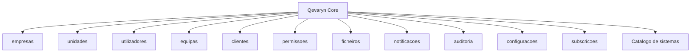

> Este documento representa uma baseline estratégica e empresarial em elaboração. Não constitui contrato, parecer jurídico, aconselhamento fiscal, certificação de conformidade ou compromisso comercial público.

> Funcionalidades, limites, preços e condições aqui descritos podem representar hipóteses de produto e precisam de validação antes da publicação ou comercialização.

# Qevaryn Platform — Plataforma Modular e Primeiro Produto "Pedidos e Trabalhos"

## 1. Definição da plataforma

Definido como `DECIDIDO`:

> A Qevaryn Platform será uma plataforma empresarial modular na qual uma empresa utiliza uma única conta e acede aos sistemas que contratou.

```text
Conta da empresa
→ Os meus sistemas
→ sistemas contratados
→ configurações
→ utilizadores
→ permissões
→ subscrição
```

A plataforma é o produto SaaS da [Qevaryn Systems](../governance/qevaryn-systems.md), operadora tecnológica da [Rede Qualidade é Vida](../governance/rede-qualidade-e-vida.md).

## 2. Inspiração da Hotmart

A inspiração está somente em (`DECIDIDO` quanto ao limite da analogia):

- conta única;
- biblioteca;
- produtos adquiridos;
- produtos visualmente separados;
- acesso desbloqueado após contratação;
- gestão central.

A Qevaryn não será inicialmente (`DECIDIDO` quanto ao limite de escopo):

- marketplace;
- plataforma de cursos;
- plataforma de produtores;
- programa de afiliados;
- checkout de infoprodutos;
- área de alunos;
- sistema de comissões.

Não utilizar publicamente a frase "Hotmart para empresas" como posicionamento oficial.

## 3. Qevaryn Core

Documentado conceitualmente (`PROPOSTA` / `A VALIDAR`):

```text
Qevaryn Core
│
├── empresas
├── unidades
├── utilizadores
├── equipas
├── clientes
├── permissões
├── ficheiros
├── notificações
├── auditoria
├── configurações
├── subscrições
└── catálogo de sistemas
```

O Core é infraestrutura comum, não um sistema vendido isoladamente.



*Figura 1 — Módulos conceptuais do Qevaryn Core. Nomes sem acentos no diagrama para compatibilidade, sem valor legal.*

## 4. Multiempresa

Requisitos futuros (`A VALIDAR` na implementação):

- cada empresa é um tenant;
- os dados devem ser isolados;
- utilizadores podem pertencer a uma ou mais empresas somente quando autorizados;
- pesquisas devem respeitar o tenant;
- ficheiros devem respeitar o tenant;
- logs devem identificar a empresa;
- permissões devem ser verificadas no servidor;
- não confiar apenas na interface;
- administradores Qevaryn precisam de acessos controlados;
- o suporte deve ser auditável.

A tecnologia concreta não é definida neste documento.

## 5. Os meus sistemas

Área da conta com cartões para (`PROPOSTA`):

- sistemas ativos;
- estado;
- alertas;
- indicadores;
- botão "Abrir sistema";
- plano;
- utilizadores autorizados;
- configuração inicial.

Exemplo ilustrativo:

```text
Pedidos e Trabalhos
Ativo
4 pedidos a validar
12 trabalhos em curso
[Abrir sistema]
```

## 6. Catálogo

Área de descoberta com (`PROPOSTA`):

- sistemas disponíveis;
- descrição;
- público;
- benefício;
- demonstração;
- preço, quando aprovado;
- pedido de contacto;
- ativação;
- dependências;
- teste, quando aprovado.

Não confundir o catálogo da plataforma com o catálogo atual do site institucional (`/produtos`).

## 7. Ativação de sistema

Fluxo conceptual (`PROPOSTA` / `A VALIDAR`):

```text
Sistema escolhido
→ plano selecionado
→ condições aceites
→ pagamento ou contrato confirmado
→ módulo ativado
→ onboarding
→ permissões configuradas
→ sistema aparece em "Os meus sistemas"
```

O pagamento automático está marcado como `A VALIDAR`.

## 8. Utilizadores e permissões

Papéis conceptuais (`PROPOSTA`):

### Proprietário

- empresa;
- subscrição;
- faturação;
- utilizadores;
- sistemas;
- permissões;
- configurações.

### Administrador

- operação;
- equipa;
- sistemas autorizados;
- configurações operacionais.

### Gestor

- pedidos;
- trabalhos;
- clientes;
- atribuição;
- orçamento;
- acompanhamento.

### Funcionário

- trabalhos atribuídos;
- agenda;
- ficheiros autorizados;
- estados;
- conclusão.

### Cliente final

- pedido;
- acompanhamento;
- resposta;
- ficheiros;
- aprovação.

### Suporte Qevaryn

- acesso excepcional;
- justificação;
- auditoria;
- limite temporal.

## 9. Primeiro sistema — Pedidos e Trabalhos

Definição funcional:

```text
Receção e Gestão de Pedidos e Trabalhos
```

"Pedidos e Trabalhos" é um nome funcional inicial, não necessariamente o nome comercial definitivo.

### 9.1 Proposta de valor

Registar:

> Receba pedidos dos seus clientes através de um link e transforme-os em trabalhos organizados, sem copiar mensagens ou criar tudo manualmente.

Regra comercial:

> O essencial resolve. Os outros sistemas automatizam, especializam e expandem.

### 9.2 Problema

Problemas documentados (`DECIDIDO` quanto ao diagnóstico):

- pedidos em WhatsApp;
- mensagens perdidas;
- áudios isolados;
- fotografias sem contexto;
- informação incompleta;
- pedidos duplicados;
- falta de responsável;
- falta de estado;
- cliente sem acompanhamento;
- trabalho criado manualmente;
- informação espalhada;
- prazos esquecidos.

### 9.3 Fluxo principal

```text
Cliente abre o link público
→ escolhe a categoria
→ explica o pedido
→ envia áudio, fotografias ou ficheiros
→ informa contacto e data
→ aceita o consentimento
→ pedido é criado
→ recebe número e link seguro
→ gestor valida
→ pede informação, prepara orçamento, recusa ou converte
→ trabalho é criado
→ responsável é atribuído
→ estados são atualizados
→ cliente acompanha
→ trabalho é concluído
→ histórico é preservado
```



```mermaid
flowchart LR
    A[Cliente abre o link publico] --> B[Escolhe categoria e descreve pedido]
    B --> C[Envia audio, fotos ou ficheiros]
    C --> D[Informa contacto e data]
    D --> E[Aceita consentimento]
    E --> F[Pedido criado]
    F --> G[Gestor valida]
    G --> H[Converte em trabalho]
    H --> I[Responsavel atribuido]
    I --> J[Estados atualizados]
    J --> K[Cliente acompanha]
    K --> L[Trabalho concluido]
    L --> M[Historico preservado]
```

*Figura 2 — Fluxo principal de um pedido público até à conclusão do trabalho.*

### 9.4 Regra obrigatória de validação

Definido como `DECIDIDO`:

> Todo pedido público entra como "Pedido recebido — A validar".

> Um pedido público não pode tornar-se automaticamente um trabalho confirmado no plano essencial.

Somente utilizador autorizado pode executar:

```text
Converter em trabalho
```

Automações futuras somente poderão converter automaticamente quando existirem (`A VALIDAR`):

- regras explícitas;
- clientes autorizados;
- auditoria;
- possibilidade de desativação;
- tratamento de falhas;
- limites;
- confirmação contratual.

### 9.5 Página pública

Documentar (`PROPOSTA` / `A VALIDAR`):

- URL por empresa;
- exemplo `qevaryn.pt/pedir/grafica-silva`;
- possibilidade futura de domínio personalizado;
- logótipo do cliente;
- cores do cliente;
- descrição;
- categorias;
- contactos;
- horário;
- política;
- acessibilidade;
- responsividade;
- "Powered by Qevaryn" discreto.

### 9.6 Origem dos pedidos

Possíveis origens (`PROPOSTA`):

- link;
- QR Code;
- site;
- WhatsApp;
- Instagram;
- Facebook;
- Google;
- email;
- criação interna;
- API futura.

Guardar a origem para análise e auditoria.

### 9.7 Formulário público

Etapas conceptuais (`PROPOSTA`):

#### Categoria

- configurável;
- opção "Outro";
- perguntas condicionais futuras.

#### Descrição

- texto;
- limite;
- orientação simples;
- sem termos técnicos.

#### Áudio

- gravar;
- ouvir;
- apagar;
- reenviar;
- tamanho e duração a validar.

#### Fotografias

- múltiplas;
- pré-visualização;
- remoção;
- formato;
- tamanho;
- segurança.

#### Documentos

- PDF;
- documentos comuns;
- formatos permitidos;
- verificação;
- armazenamento seguro.

#### Data pretendida

- preferência;
- não representa confirmação;
- urgência;
- flexibilidade.

#### Contacto

- nome;
- email;
- telefone;
- melhor forma;
- empresa, quando aplicável.

#### Consentimento

- política;
- tratamento;
- comunicação;
- finalidade;
- retenção.

#### Revisão

- resumo;
- edição;
- confirmação.

#### Sucesso

- número;
- estado;
- link seguro;
- próximos passos;
- prazo de resposta apenas quando definido.

### 9.8 Caixa de pedidos

Área de gestão com (`PROPOSTA`):

- lista;
- pesquisa;
- filtros;
- data;
- origem;
- categoria;
- cliente;
- estado;
- responsável;
- prioridade;
- duplicado;
- spam;
- incompleto;
- atividade recente.

### 9.9 Estados do pedido

Lista proposta (`PROPOSTA`, exceto "A validar" que é `DECIDIDO`):

```text
A validar
Aguardando informação
Em análise
Orçamento em preparação
Orçamento enviado
Aceite
Recusado
Cancelado
Spam
Duplicado
Convertido em trabalho
```

### 9.10 Pedido de mais informação

Fluxo:

```text
Gestor envia pergunta
→ cliente recebe link/notificação
→ cliente responde
→ resposta entra no histórico
→ gestor continua análise
```

Permitir:

- texto;
- áudio;
- ficheiro;
- fotografia;
- telefone, quando necessário.

### 9.11 Orçamento

Documentado como parte possível do essencial ou do Crescimento, conforme decisão comercial final (`A VALIDAR`).

Funcionalidades conceptuais:

- itens;
- descrição;
- quantidades;
- preço;
- impostos;
- validade;
- condições;
- versões;
- envio;
- aceite;
- recusa;
- comentários;
- histórico.

Não implementar faturação certificada.

### 9.12 Conversão em trabalho

Ação idempotente (`DECIDIDO` quanto à regra):

Ao converter:

- preservar o pedido original;
- criar referência ao pedido;
- copiar cliente;
- copiar categoria;
- copiar descrição;
- copiar ficheiros autorizados;
- copiar prazo pretendido como informação;
- permitir prioridade;
- permitir responsável;
- permitir data;
- permitir instruções;
- registar utilizador;
- registar data;
- impedir duplicação acidental.

### 9.13 Estados do trabalho

Lista proposta (`PROPOSTA`):

```text
Rascunho
Planeado
Atribuído
Confirmado
Em curso
Pausado
Aguardando cliente
Em validação
Concluído
Cancelado
```

### 9.14 Detalhe do trabalho

Incluir (`PROPOSTA`):

- código;
- cliente;
- origem;
- pedido original;
- descrição;
- responsável;
- equipa;
- prioridade;
- datas;
- prazo;
- estado;
- notas internas;
- mensagens ao cliente;
- ficheiros;
- histórico;
- atividade;
- orçamento;
- módulo relacionado.

### 9.15 Experiência do gestor

O gestor pode (`PROPOSTA`):

- validar;
- pedir informação;
- classificar spam;
- marcar duplicado;
- recusar;
- preparar orçamento;
- converter;
- atribuir;
- acompanhar;
- concluir;
- reabrir mediante permissão;
- consultar histórico.

### 9.16 Experiência do funcionário

O funcionário visualiza apenas (`PROPOSTA` / `A VALIDAR`):

- trabalhos autorizados;
- agenda;
- cliente necessário;
- localização necessária;
- instruções;
- ficheiros;
- notas permitidas;
- estados;
- conclusão.

Não vê automaticamente:

- preços;
- subscrição;
- faturação;
- catálogo de módulos;
- dados administrativos;
- todos os clientes;
- todos os trabalhos.

### 9.17 Experiência do cliente final

No essencial, o cliente não precisa de conta (`DECIDIDO` quanto ao modelo de acesso).

Através de link seguro pode:

- acompanhar;
- responder;
- enviar ficheiro;
- enviar áudio;
- aprovar;
- recusar;
- pedir contacto;
- ver histórico permitido.

O link deve:

- ser difícil de adivinhar;
- poder expirar;
- poder ser revogado;
- não expor notas internas;
- não permitir acesso a outros clientes.

### 9.18 Clientes

Entidade conceptual (`PROPOSTA`):

- pessoa ou empresa;
- contactos;
- consentimentos;
- pedidos;
- trabalhos;
- documentos;
- histórico;
- preferências;
- estado;
- origem.

Prevenir duplicados.

### 9.19 Agenda

Essencial (`PROPOSTA`):

- prazos;
- trabalhos;
- atribuições;
- datas;
- filtros;
- lista;
- calendário.

Não incluir FieldOps avançado automaticamente.

### 9.20 Ficheiros

Requisitos (`PROPOSTA` / `A VALIDAR`):

- formatos permitidos;
- limite;
- antivírus ou análise futura;
- armazenamento;
- autorização;
- download;
- auditoria;
- retenção;
- eliminação;
- thumbnails;
- privacidade;
- ficheiros internos e externos separados.

### 9.21 Notificações

Essencial (`PROPOSTA`):

- internas;
- email básico;
- novo pedido;
- resposta;
- atribuição;
- prazo;
- alteração de estado.

Futuro (`PROPOSTA` / `A VALIDAR`):

- WhatsApp;
- SMS;
- Instagram;
- Facebook;
- automações;
- preferências.

Custos externos devem ser separados.

## 10. Módulos futuros

Todos classificados como `PROPOSTA / FUTURO`:

### Comunicação

- WhatsApp Business;
- Instagram;
- Facebook;
- SMS;
- email;
- caixa unificada;
- modelos;
- histórico;
- permissões.

### Portal do Cliente

- conta;
- vários pedidos;
- documentos;
- mensagens;
- histórico;
- aprovações;
- pagamentos futuros.

### FieldOps

- check-in;
- check-out;
- QR Code;
- NFC;
- checklists;
- fotografias;
- assinatura;
- incidentes;
- relatório;
- offline futuro.

### Produção

- etapas;
- fila;
- revisão;
- aprovação;
- materiais;
- qualidade;
- entrega.

### Stock e Compras

- artigos;
- materiais;
- fornecedores;
- entradas;
- saídas;
- consumo;
- reposição;
- compras.

### Automação

- recorrência;
- regras;
- avisos;
- tarefas;
- mensagens;
- estados;
- conversão controlada.

### Relatórios

- pedidos;
- trabalhos;
- estados;
- origem;
- prazos;
- equipas;
- clientes;
- módulos.

### Múltiplas unidades

- filiais;
- lojas;
- equipas;
- permissões;
- relatórios;
- configurações.

## 11. Planos e preços ilustrativos

> HIPÓTESE COMERCIAL DE EXEMPLO — NÃO PUBLICAR, NÃO CODIFICAR E NÃO UTILIZAR EM CONTRATOS SEM VALIDAÇÃO.

Os preços são ilustrativos.

### 11.1 Essencial

```text
29 € + IVA por mês
290 € + IVA por ano
3 utilizadores incluídos
```

Incluir como hipótese:

- uma empresa;
- uma página pública;
- Pedidos e Trabalhos;
- link;
- QR Code;
- texto;
- áudio;
- fotografias;
- documentos;
- clientes;
- pedidos;
- trabalhos;
- agenda;
- estados;
- histórico;
- acompanhamento por link;
- notificações internas;
- email básico;
- suporte normal.

Marcar como `A VALIDAR`:

- armazenamento;
- volume de pedidos;
- duração dos áudios;
- tamanho de ficheiros;
- retenção;
- número de categorias;
- utilização mensal.

### 11.2 Crescimento

```text
69 € + IVA por mês
690 € + IVA por ano
10 utilizadores incluídos
```

Marcar como:

```text
Plano recomendado — hipótese comercial
```

Incluir como hipótese:

- tudo do Essencial;
- formulários configuráveis;
- categorias avançadas;
- orçamentos;
- versões;
- permissões detalhadas;
- pedidos recorrentes;
- automações básicas;
- relatórios;
- maior armazenamento;
- personalização;
- suporte prioritário;
- um módulo adicional elegível, sujeito a decisão.

Não afirmar ainda qual módulo estará incluído.

### 11.3 Empresarial

```text
Desde 149 € + IVA por mês
Preço final sob proposta
25 utilizadores iniciais como referência
```

Incluir:

- múltiplas unidades;
- permissões avançadas;
- auditoria;
- API;
- integrações;
- maior volume;
- onboarding;
- formação;
- suporte prioritário;
- condições contratuais;
- módulos empresariais;
- ambientes especiais, quando necessários;
- SLA somente quando aprovado.

Não apresentar 149 € como preço garantido para qualquer empresa.

### 11.4 Anual

Hipótese (`PROPOSTA`):

- pagamento anual equivalente aproximadamente a dez mensalidades;
- desconto sujeito a validação;
- renovação;
- cancelamento;
- reembolso;
- impostos;
- faturação.

### 11.5 Adicionais ilustrativos

```text
Utilizador adicional: 4 €/mês
Portal do Cliente: 15 €/mês
Automação: 19 €/mês
Comunicação: desde 19 €/mês + custos de fornecedores
FieldOps: 25 €/mês
Produção: 29 €/mês
Stock e Compras: 29 €/mês
Unidade adicional: 20 €/mês
Configuração Essencial: 99 € uma vez
Configuração Crescimento: 249 € uma vez
Implementação Empresarial: desde 990 €
```

Classificação de todos:

```text
EXEMPLO — NÃO APROVADO
```

### 11.6 Custos que precisam ser considerados

Documentar:

- armazenamento;
- áudio;
- imagens;
- ficheiros;
- backups;
- emails;
- SMS;
- WhatsApp;
- suporte;
- onboarding;
- formação;
- gateways;
- impostos;
- fraude;
- logs;
- monitorização;
- integrações;
- processamento;
- base de dados;
- ambientes;
- assistência.

Risco registado:

> O preço de 29 € pode não ser sustentável caso o plano inclua utilização elevada, armazenamento significativo ou suporte humano frequente.

### 11.7 Ciclo da subscrição

Proposta (`PROPOSTA` / `A VALIDAR`):

```text
Teste ou demonstração
→ seleção
→ contratação
→ ativação
→ onboarding
→ utilização
→ renovação
→ upgrade ou downgrade
→ cancelamento
→ retenção ou exportação
→ encerramento
```

Marcar como `A VALIDAR`:

- teste gratuito;
- cartão obrigatório;
- período;
- proration;
- suspensão;
- atraso;
- reativação;
- exportação;
- eliminação.

## 12. Modelo de dados conceptual

Entidades conceptuais (`A VALIDAR`; não é um schema real):

- Tenant;
- Company;
- Unit;
- User;
- Membership;
- Role;
- Permission;
- Subscription;
- Plan;
- Module;
- ModuleActivation;
- Customer;
- Request;
- RequestCategory;
- RequestMessage;
- Attachment;
- Quote;
- QuoteVersion;
- Job;
- JobAssignment;
- JobStatusHistory;
- Notification;
- PublicTrackingToken;
- AuditEvent;
- ConsentRecord.

Não criar schema real, não escolher base de dados e não criar migrations.

## 13. Segurança e RGPD do produto

Requisitos (`A VALIDAR` na implementação):

- isolamento;
- autorização;
- links seguros;
- expiração;
- revogação;
- consentimento;
- logs;
- retenção;
- exportação;
- eliminação;
- ficheiros privados;
- acesso de suporte;
- incidentes;
- subcontratantes;
- backups;
- minimização;
- informação ao titular.

Não afirmar certificação.

## 14. Requisitos não funcionais

Direção (`DECIDIDO` quanto aos objetivos):

- acessibilidade;
- responsividade;
- mobile-first;
- desempenho;
- observabilidade;
- segurança;
- escalabilidade;
- manutenibilidade;
- internacionalização futura;
- recuperação;
- auditoria;
- disponibilidade;
- usabilidade;
- clareza.

## 15. Fora do MVP

Não fazer no MVP (`DECIDIDO` quanto ao limite):

- faturação certificada;
- contabilidade;
- pagamentos complexos;
- marketplace;
- afiliados;
- aplicação nativa completa;
- IA avançada;
- automações irrestritas;
- todos os módulos;
- offline completo;
- integrações ilimitadas;
- personalização de código por cliente;
- migrações complexas;
- hardware.

## 16. Validação do produto

Programa-piloto (`PROPOSTA` / `A VALIDAR`):

- entrevistar empresas;
- selecionar setores;
- apresentar protótipo;
- testar entendimento;
- testar processo;
- testar preço;
- recolher objeções;
- medir utilização;
- identificar funcionalidades essenciais;
- documentar resultados;
- obter autorização para caso real.

Possíveis setores:

- limpeza;
- manutenção;
- gráficas;
- oficinas;
- serviços;
- hotelaria;
- pequenos negócios;
- equipas externas.

## 17. Métricas futuras

Documentar sem inventar valores (`PROPOSTA`):

- pedidos recebidos;
- pedidos validados;
- conversão em trabalho;
- tempo de resposta;
- tempo de validação;
- pedidos incompletos;
- pedidos duplicados;
- trabalhos concluídos;
- prazo;
- utilização;
- retenção;
- upgrade;
- satisfação;
- suporte.

## 18. Encerramento do documento

### Decisões

- A plataforma é modular e usa uma única conta por empresa.
- Todo pedido público entra "A validar".
- O primeiro sistema é Pedidos e Trabalhos.
- O cliente essencial não precisa de conta.
- Faturação certificada, marketplace e afiliados estão fora do MVP.

### Propostas

- planos e preços (hipótese);
- módulos futuros;
- programa-piloto;
- papéis de utilizador.

### Exemplos

- preços Essencial, Crescimento e Empresarial;
- adicionais ilustrativos.

### Pontos a validar

- armazenamento e volume por plano;
- orçamento no Essencial vs Crescimento;
- pagamento automático;
- SLA;
- módulo incluído no Crescimento.

### Ideias substituídas

- Apresentar os conceitos históricos como produtos concluídos. Nova direção: Pedidos e Trabalhos como primeiro sistema essencial; FieldOps e demais como módulos futuros.

### Perguntas para Gabriel

- O orçamento entra no Essencial ou no Crescimento?
- Qual módulo deve estar incluído no Crescimento?
- O preço de 29 € deve ser validado com que limites?
- Deve existir teste gratuito? Com que condições?
- Quais setores devem entrar no piloto primeiro?

### Histórico de alterações

| Data | Versão | Alteração | Autor |
| --- | --- | --- | --- |
| 2026-08-07 | 0.1 | Criação da baseline de produto da Qevaryn Platform | Gabriel Dias de Souza |

## Documentos relacionados

- [Qevaryn Systems — Identidade Empresarial, Operação e Modelo de Negócio](../governance/qevaryn-systems.md)
- [Rede Qualidade é Vida — Governança, Marca, Cooperação e Regras Institucionais](../governance/rede-qualidade-e-vida.md)
